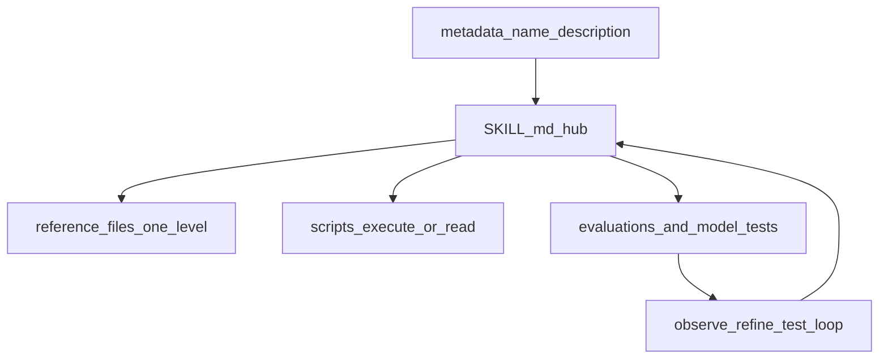

# Skill Authoring

## Contents

- [Mental Model](#mental-model) - How skills load and how context is consumed
- [Visual Overview](#visual-overview) - File layout and evaluation loop map
- [Quick Reference](#quick-reference) - Limits, metadata constraints, storage locations
- [Task Router](#task-router) - Where to go based on the task type
- [Before You Begin](#before-you-begin) - Required discovery questions
- [Workflow](#workflow) - End-to-end skill creation and refresh flow
- [Description Requirements](#description-requirements) - Discovery-critical frontmatter guidance
- [Runtime And Tooling Requirements](#runtime-and-tooling-requirements) - Dependencies, MCP naming, script intent
- [Validation And Intermediate Outputs](#validation-and-intermediate-outputs) - Plan-validate-execute safety pattern
- [TOC And Reference Rules](#toc-and-reference-rules) - Navigation and depth constraints
- [Reference Files](#reference-files) - Patterns, checklist, anti-patterns

---

Skills are selective-load information systems. Keep SKILL.md concise, route to detailed files, and verify outcomes with repeatable checks.

## Mental Model

```text
Startup:    Skill metadata (name/description) is pre-loaded
Trigger:    SKILL.md loads on demand
Navigation: Reference files load only when explicitly read
Execution:  Scripts can run without loading source into context
```

Design for discoverability first, then detail depth.

## Visual Overview



## Quick Reference

| Constraint          | Limit                                               |
| ------------------- | --------------------------------------------------- |
| SKILL.md body       | Under 500 lines                                     |
| TOC required        | Any file over 100 lines                             |
| Reference depth     | One level from SKILL.md                             |
| Name format         | Lowercase letters, numbers, hyphens; under 64 chars |
| Name reserved words | Do not include `anthropic` or `claude`              |
| Description         | Non-empty, under 1024 chars, third person           |

### Storage Locations

| Type     | Path                           | Scope                           |
| -------- | ------------------------------ | ------------------------------- |
| Personal | `~/.cursor/skills/skill-name/` | Available across local projects |
| Project  | `.cursor/skills/skill-name/`   | Shared in repository            |

Do not create skills in `~/.cursor/skills-cursor/`.

## Task Router

**Creating a new skill?**
Start at [Before You Begin](#before-you-begin), then follow [Workflow](#workflow).

**Refreshing an existing skill?**
Start with [Workflow](#workflow) step 1 and run evaluation-first updates before restructuring docs.

**Skill is not triggering reliably?**
Use [Description Requirements](#description-requirements), then verify with [checklist.md](checklist.md).

**Need concrete templates?**
Use [patterns.md](patterns.md) for evals, runtime sections, validation loops, and output patterns.

**Need failure examples to avoid?**
Use [anti-patterns.md](anti-patterns.md).

## Before You Begin

Gather these requirements before writing or editing the skill:

1. **Purpose**: What exact task or workflow should this skill enable?
2. **Knowledge gap**: What does the agent need that it will not infer reliably?
3. **Storage**: Personal (`~/.cursor/skills/`) or project (`.cursor/skills/`)?
4. **Triggers**: When should this skill load?
5. **Output format**: Any template or strict structure required?

Use AskQuestion for structured collection when available.

## Workflow

### 1) Discovery

Capture purpose, constraints, triggers, and output expectations from the user or conversation context.

### 2) Evaluation-First Setup

Before extensive docs:

1. Run representative tasks without the skill and record gaps.
2. Create at least three evaluation scenarios.
3. Define expected behaviors and pass conditions.
4. Decide which model tiers will be used and include them in test coverage.

Use templates in [patterns.md](patterns.md).

### 3) Structure Design

```text
skill-name/
├── SKILL.md          # Hub and routing (concise)
├── references/        # Optional detailed docs
│   └── *.md
└── scripts/          # Optional utility scripts
    └── *.py
```

Keep references one level deep from `SKILL.md`.

### 4) Authoring

Write `SKILL.md` as a navigation hub:

- Include frontmatter (`name`, `description`).
- Add TOC if file exceeds 100 lines.
- Keep common workflows inline and concise.
- Link to references with context.
- Add runtime/tooling guidance where relevant.

### 5) Verification

Run checks from [checklist.md](checklist.md), including discovery quality, structure, runtime/tooling clarity, and validation patterns.

### 6) Observe-Refine-Test Loop

Use two instances conceptually:

- **Authoring instance**: updates instructions and structure.
- **Testing instance**: executes real tasks using the skill.

Observe behavior, capture misses, refine instructions, rerun evaluations, and repeat.

## Description Requirements

Description is discovery-critical and must include:

1. **Capabilities** (what the skill does)
2. **Triggers** (when to use it)
3. **Keywords** (terms users are likely to say)
4. **Third-person voice**

```yaml
# Good
description: Extracts text and tables from PDF files, fills forms, and merges documents. Use when working with PDFs, form workflows, or document extraction tasks.

# Bad
description: I can help with PDFs.
```

## Runtime And Tooling Requirements

When a skill uses scripts or external tools:

1. Do not assume dependencies are installed.
2. List required packages and installation steps where needed.
3. State script intent explicitly:
   - "Run `scripts/validate.py`" (execute)
   - "Read `scripts/validate.py`" (reference)
4. Use fully qualified MCP tool names: `ServerName:tool_name`.

Example: `GitHub:create_issue`, `BigQuery:bigquery_schema`.

## Validation And Intermediate Outputs

For risky, destructive, or large batch tasks, require plan-validate-execute:

1. Produce intermediate plan artifact (for example `changes.json`).
2. Validate plan artifact with deterministic checks.
3. Execute only if validation passes.
4. Verify result and loop on failures.

Use templates in [patterns.md](patterns.md).

## TOC And Reference Rules

- Any markdown file over 100 lines needs a self-descriptive TOC.
- TOC entries must include context, not just labels.
- Link all reference files directly from `SKILL.md` (one-level depth).
- Avoid deep nesting and ambiguous file names.

## Reference Files

- [patterns.md](patterns.md) - Reusable templates for evaluations, model testing, runtime/tooling sections, validation loops, and workflow structures
- [checklist.md](checklist.md) - Final verification list before sharing or relying on a skill
- [anti-patterns.md](anti-patterns.md) - Common failure modes and concrete corrections
